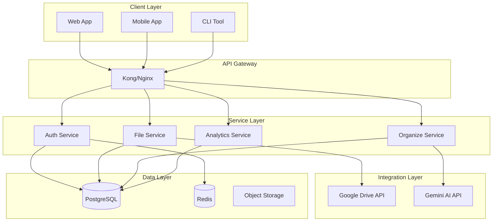

# 🏗️ Google Drive AI Organizer - 시스템 아키텍처

## 📋 목차
- [시스템 개요](#시스템-개요)
- [기술 스택](#기술-스택)
- [컴포넌트 구조](#컴포넌트-구조)
- [데이터 플로우](#데이터-플로우)
- [보안 아키텍처](#보안-아키텍처)
- [확장성 고려사항](#확장성-고려사항)

## 시스템 개요

Google Drive AI Organizer는 마이크로서비스 아키텍처를 기반으로 설계된 클라우드 네이티브 애플리케이션입니다.

### 핵심 설계 원칙

1. **모듈성**: 각 컴포넌트는 독립적으로 배포 가능
2. **확장성**: 수평적 확장 가능한 구조
3. **복원력**: 장애 격리 및 자동 복구
4. **보안성**: 다층 보안 구조

## 기술 스택

### Backend
- **Framework**: FastAPI (Python 3.9+)
- **Authentication**: OAuth 2.0, JWT
- **Database**: SQLAlchemy + PostgreSQL
- **Cache**: Redis
- **Queue**: Celery + RabbitMQ
- **AI/ML**: Google Gemini AI

### Frontend
- **Framework**: React 18
- **State Management**: Redux Toolkit
- **UI Library**: Material-UI
- **Build Tool**: Vite
- **TypeScript**: v5.0+

### Infrastructure
- **Container**: Docker
- **Orchestration**: Kubernetes
- **CI/CD**: GitHub Actions
- **Monitoring**: Prometheus + Grafana
- **Logging**: ELK Stack

## 컴포넌트 구조



## 데이터 플로우

### 1. 인증 플로우

```python
@router.get("/auth/google")
async def google_auth():
    """
    1. 클라이언트 → OAuth 요청
    2. Google OAuth → 인증 코드 반환
    3. 백엔드 → 액세스 토큰 교환
    4. JWT 토큰 생성 → 클라이언트
    """
    flow = Flow.from_client_config(
        client_config=GOOGLE_OAUTH_CONFIG,
        scopes=GOOGLE_SCOPES
    )
    auth_url = flow.authorization_url()
    return RedirectResponse(auth_url)
```

### 2. 파일 분류 플로우

```python
async def classify_files(files: List[FileInfo]):
    """
    1. 파일 메타데이터 수집
    2. Gemini AI 분석 요청
    3. 분류 결과 처리
    4. 폴더 구조 생성/업데이트
    5. 파일 이동 실행
    """
    tasks = []
    for file in files:
        task = classify_single_file(file)
        tasks.append(task)
    
    results = await asyncio.gather(*tasks)
    return process_classification_results(results)
```

### 3. 실시간 동기화 플로우

```python
class DriveChangeDetector:
    """
    Google Drive 변경사항 실시간 감지
    """
    async def start_monitoring(self):
        page_token = await self.get_start_page_token()
        
        while True:
            changes = await self.fetch_changes(page_token)
            
            for change in changes:
                await self.process_change(change)
            
            page_token = changes.next_page_token
            await asyncio.sleep(10)  # 10초 간격 폴링
```

## 보안 아키텍처

### 1. 인증 및 권한 부여

```python
class SecurityMiddleware:
    """
    모든 요청에 대한 보안 검증
    """
    def __init__(self):
        self.jwt_validator = JWTValidator()
        self.rate_limiter = RateLimiter()
        self.ip_filter = IPFilter()
    
    async def validate_request(self, request):
        # JWT 검증
        if not self.jwt_validator.verify(request.headers):
            raise UnauthorizedException()
        
        # Rate Limiting
        if not self.rate_limiter.check(request.client):
            raise RateLimitException()
        
        # IP 필터링
        if not self.ip_filter.is_allowed(request.client.host):
            raise ForbiddenException()
```

### 2. 데이터 암호화

- **전송 중**: TLS 1.3
- **저장 시**: AES-256-GCM
- **키 관리**: AWS KMS / Google Cloud KMS

### 3. 감사 로깅

```python
@contextmanager
def audit_log(action: str, user_id: str):
    """
    모든 중요 작업에 대한 감사 로그
    """
    start_time = datetime.utcnow()
    
    try:
        yield
        log_entry = {
            "action": action,
            "user_id": user_id,
            "timestamp": start_time,
            "status": "success",
            "duration": (datetime.utcnow() - start_time).total_seconds()
        }
    except Exception as e:
        log_entry = {
            "action": action,
            "user_id": user_id,
            "timestamp": start_time,
            "status": "failed",
            "error": str(e)
        }
        raise
    finally:
        audit_logger.log(log_entry)
```

## 확장성 고려사항

### 1. 수평적 확장

```yaml
# kubernetes/deployment.yaml
apiVersion: apps/v1
kind: Deployment
metadata:
  name: gdrive-organizer
spec:
  replicas: 3
  strategy:
    type: RollingUpdate
    rollingUpdate:
      maxSurge: 1
      maxUnavailable: 0
  template:
    spec:
      containers:
      - name: api
        image: gdrive-organizer:latest
        resources:
          requests:
            memory: "256Mi"
            cpu: "250m"
          limits:
            memory: "512Mi"
            cpu: "500m"
```

### 2. 캐싱 전략

```python
class CacheStrategy:
    """
    다층 캐싱 전략
    """
    def __init__(self):
        self.l1_cache = InMemoryCache(ttl=60)  # 1분
        self.l2_cache = RedisCache(ttl=3600)    # 1시간
        self.l3_cache = CDNCache(ttl=86400)     # 1일
    
    async def get(self, key: str):
        # L1 캐시 확인
        if value := self.l1_cache.get(key):
            return value
        
        # L2 캐시 확인
        if value := await self.l2_cache.get(key):
            self.l1_cache.set(key, value)
            return value
        
        # L3 캐시 확인
        if value := await self.l3_cache.get(key):
            await self.l2_cache.set(key, value)
            self.l1_cache.set(key, value)
            return value
        
        return None
```

### 3. 데이터베이스 최적화

```sql
-- 인덱스 최적화
CREATE INDEX idx_files_user_modified 
ON files(user_id, modified_time DESC);

CREATE INDEX idx_files_folder_name 
ON files(folder_id, name);

-- 파티셔닝
CREATE TABLE files_2025 PARTITION OF files 
FOR VALUES FROM ('2025-01-01') TO ('2026-01-01');

-- 읽기 전용 복제본
CREATE PUBLICATION files_pub FOR TABLE files;
CREATE SUBSCRIPTION files_sub 
CONNECTION 'host=replica1 dbname=gdrive' 
PUBLICATION files_pub;
```

### 4. 비동기 처리

```python
class AsyncJobProcessor:
    """
    대용량 작업 비동기 처리
    """
    def __init__(self):
        self.queue = asyncio.Queue()
        self.workers = []
    
    async def start(self, num_workers=5):
        for i in range(num_workers):
            worker = asyncio.create_task(self.worker(f"worker-{i}"))
            self.workers.append(worker)
    
    async def worker(self, name: str):
        while True:
            job = await self.queue.get()
            try:
                await self.process_job(job)
            except Exception as e:
                logger.error(f"{name} failed: {e}")
            finally:
                self.queue.task_done()
    
    async def add_job(self, job):
        await self.queue.put(job)
```

## 모니터링 및 관찰성

### 1. 메트릭 수집

```python
from prometheus_client import Counter, Histogram, Gauge

# 메트릭 정의
request_count = Counter('http_requests_total', 'Total HTTP requests')
request_duration = Histogram('http_request_duration_seconds', 'HTTP request duration')
active_users = Gauge('active_users', 'Number of active users')

@app.middleware("http")
async def metrics_middleware(request, call_next):
    start_time = time.time()
    
    response = await call_next(request)
    
    request_count.inc()
    request_duration.observe(time.time() - start_time)
    
    return response
```

### 2. 분산 추적

```python
from opentelemetry import trace
from opentelemetry.exporter.jaeger import JaegerExporter

tracer = trace.get_tracer(__name__)

@tracer.start_as_current_span("organize_files")
async def organize_files(user_id: str):
    span = trace.get_current_span()
    span.set_attribute("user.id", user_id)
    
    with tracer.start_as_current_span("fetch_files"):
        files = await fetch_user_files(user_id)
    
    with tracer.start_as_current_span("classify_files"):
        classifications = await classify_files(files)
    
    with tracer.start_as_current_span("move_files"):
        results = await move_files(classifications)
    
    return results
```

### 3. 에러 추적

```python
import sentry_sdk
from sentry_sdk.integrations.fastapi import FastApiIntegration

sentry_sdk.init(
    dsn="YOUR_SENTRY_DSN",
    integrations=[FastApiIntegration()],
    traces_sample_rate=0.1,
    profiles_sample_rate=0.1,
)

@app.exception_handler(Exception)
async def global_exception_handler(request, exc):
    sentry_sdk.capture_exception(exc)
    return JSONResponse(
        status_code=500,
        content={"detail": "Internal server error"}
    )
```

## 재해 복구

### 1. 백업 전략

```bash
#!/bin/bash
# backup.sh

# 데이터베이스 백업
pg_dump -h localhost -U gdrive_user gdrive_db > backup_$(date +%Y%m%d).sql

# S3 업로드
aws s3 cp backup_$(date +%Y%m%d).sql s3://gdrive-backups/

# 7일 이상 된 백업 삭제
find . -name "backup_*.sql" -mtime +7 -delete
```

### 2. 복구 절차

```python
class DisasterRecovery:
    """
    재해 복구 자동화
    """
    async def initiate_recovery(self):
        # 1. 헬스 체크
        if not await self.health_check():
            # 2. 백업에서 복구
            await self.restore_from_backup()
            
            # 3. 데이터 일관성 검증
            await self.verify_data_integrity()
            
            # 4. 서비스 재시작
            await self.restart_services()
            
            # 5. 알림 발송
            await self.notify_team()
```

## 성능 최적화

### 1. 쿼리 최적화

```python
# Bad
files = db.query(File).all()
for file in files:
    folder = db.query(Folder).filter_by(id=file.folder_id).first()

# Good
files = db.query(File).join(Folder).all()
```

### 2. 배치 처리

```python
async def batch_process_files(files: List[File], batch_size=100):
    """
    대량 파일 배치 처리
    """
    for i in range(0, len(files), batch_size):
        batch = files[i:i+batch_size]
        tasks = [process_file(file) for file in batch]
        await asyncio.gather(*tasks)
        
        # Rate limiting
        await asyncio.sleep(1)
```

### 3. 연결 풀링

```python
# database.py
from sqlalchemy.pool import QueuePool

engine = create_engine(
    DATABASE_URL,
    poolclass=QueuePool,
    pool_size=20,
    max_overflow=40,
    pool_pre_ping=True,
    pool_recycle=3600
)
```

---

<p align="center">
  <i>이 문서는 지속적으로 업데이트됩니다.</i>
</p>